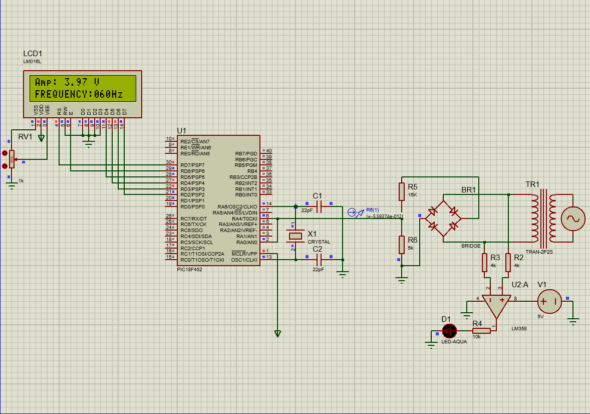

# Frequency and Amplitude measurement 
📟 Frequency and Amplitude Measurement Device using PIC18F452.
Microprocessor and Microcontroller Based Design Project – NUST CEME

## 🔧 Overview
This project implements a Frequency and Amplitude Measurement Device using the PIC18F452 microcontroller. It is designed to measure the frequency of an external input signal and display the result on an LCD module in real-time. Timer0 is utilized to measure frequency and internal ADC for amplitude calculation. The system is developed as part of the Microprocessor and Microcontroller-Based Design course.

## Badges

## Acknowledgements

 - [Microcontroller Lab's Youtube channel](https://www.youtube.com/@Microcontrollerslab)
 - [Microcontroller Lab's Website](https://microcontrollerslab.com/)

## Authors
- [@MehranDanish2](https://github.com/MehranDanish2/MehranDanish2.git)
- [@usmanawan50](https://github.com/usmanawan50/usmanawan50.git)
  
## 📌 Features
1. Measures frequency of digital signals upto 100Hz and 325Vrms. 
2. Measure amplitude of step-down input voltage. 
3. Intuitive output using 16x2 LCD.

## 🖥 Software & Tools Used
1. C 99. 
2. MikroC IDE. 
3. Proteus 8.15(for simulation)
4. PICKit3 (for programming hardware)

## ⚙ Hardware Components
1. PIC18F452 Microcontroller. 
2. 16x2 Character LCD Display. 
3. 8MHz Crystal Oscillator. 
4. Regulated DC Power supply. 
5. Breadboard and jumper wires. 
6. Rectifier bridge. 
7. LM351 amplifier. 
8. 22pf Capacitors. 
9. 10K potientiometers. 
10. Resistors.

## 🧠 Working Principle
Timer1 is configured as a counter for incoming pulses. A gate time (e.g., 1 second) is defined using another timer (e.g., Timer0). After the gate time, the pulse count is captured and converted into frequency.
The result is displayed on the LCD. 
This method provides reasonably accurate frequency measurements for most low-to-mid-frequency digital signals.

## FAQ

#### How can this project be scaled up in the future?

Currently, this project relies on Timer0 and internal ADC of the PIC18F452 microcontroller. We can easily upgrade to PIC18F458 and use  pulse width modulation(PWM) features provided by its Enhanced Capture/Compare/PWM(ECCP) module. We can also use specialized Analog to digital converter(ADC) for amplitude measurement.

## Usage/Examples

will be updated in the future!

 (Proteus 8 Professional)

